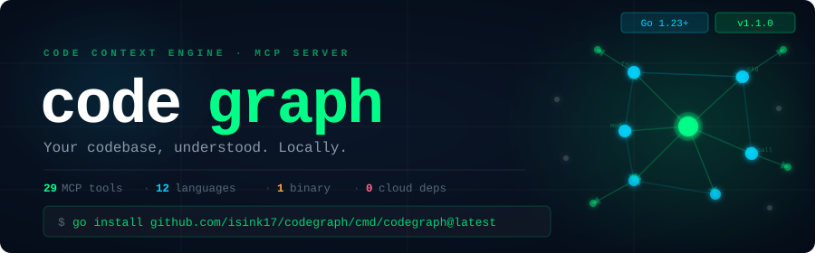

<p align="center">
  
</p>

<p align="center">
  <a href="https://github.com/isink17/codegraph/releases/latest"></a>
  <a href="https://pkg.go.dev/github.com/isink17/codegraph"></a>
  <a href="LICENSE"></a>
  
  
</p>

<br/>

`codegraph` is a **local-first code context engine and MCP server** that builds a persistent knowledge graph of your source repositories in SQLite. It gives AI coding assistants deep structural awareness — symbols, call graphs, dependencies, and semantic search — without sending a single byte to the cloud.

**Single binary. Zero config. No external databases. No API keys.**

---

## Why codegraph?

AI coding assistants are powerful, but they spend most of their token budget *discovering* what to change — grepping files, reading code, reconstructing call graphs from partial evidence.

**codegraph shifts that cost.** One call to `context_for_task` returns the exact files, symbols, and relationships an agent needs. One call to `agentic_query` gets a synthesized answer backed by graph traversal and semantic search.

```
❌ Without codegraph
   AI reads files one by one → greps for patterns → burns tokens on context-gathering

✅ With codegraph
   AI calls context_for_task("add retry logic to HTTP client")
   → instantly gets relevant files, functions, callers, callees, and tests
```

---

## How It Works

```
Your Code ──▶ tree-sitter AST ──▶ SQLite Graph ──▶ MCP Tools ──▶ AI Assistant
                    │                   │                │
               12 languages       symbols, edges      29 tools
               framework detect   embeddings          agentic reasoning
               import resolution  session memory      hybrid search
```

`codegraph index .` walks your repo, parses every file with tree-sitter, resolves imports using four strategies (exact, name, suffix, method-receiver), and writes a fully-linked symbol graph into a local `codegraph.sqlite`. The MCP server then exposes that graph to any compatible AI assistant via 29 structured tools — no cloud, no Docker, no API keys.

---

## Features

### 🔍 Parsing & Indexing

- **Tree-sitter parsing** for all 12 supported languages — robust AST extraction, not regex
- **4-strategy import resolution** — exact, name, suffix, and method-receiver matching
- **Cross-language linking** — connects symbols across language boundaries
- **Incremental updates** — only re-indexes changed files; fast on large repos
- **Framework detection** — recognizes 20+ frameworks (Express, Django, gin, React, Spring, Laravel, …)

### 🔎 Search & Query

- **Hybrid search** — vector similarity (Ollama embeddings) + FTS5, fused with Reciprocal Rank Fusion
- **Semantic search** — find code by meaning, not just text
- **Call graph traversal** — callers, callees, transitive dependency chains
- **Impact analysis** — know what breaks before you change it
- **Dead code detection** — find symbols with zero references
- **Architecture overview** — language breakdown, entry points, hub symbols, coupling metrics

### 🤖 AI Integration

- **29 MCP tools** — comprehensive API for AI coding assistants
- **Agentic reasoning** — ReAct loop over a local Ollama LLM that chains tools and synthesizes answers
- **Context building** — one tool call returns everything an agent needs for a task
- **Session memory** — persist reads, edits, decisions, and facts across sessions
- **Token benchmarking** — measure savings vs. naive file reading

### 📊 Graph Analytics

- **PageRank** — find the most important symbols in your codebase
- **Coupling metrics** — identify tightly coupled file pairs
- **Cycle detection** — find circular dependencies at the file level
- **Interactive visualization** — D3.js force-directed graph with search and zoom

### 🛠 Developer Experience

- **Single Go binary** — no runtime dependencies, cross-platform
- **Zero-config SQLite** — no Docker, no external databases
- **`codegraph install`** — auto-detects and configures Claude Code, Cursor, Windsurf, Gemini CLI
- **File watching** — automatic re-indexing on changes
- **100% local** — no data leaves your machine

---

## Supported Languages

All languages use tree-sitter for AST parsing:

| Language | Extensions |
|---|---|
| Go | `.go` |
| Python | `.py` |
| TypeScript | `.ts`, `.tsx` |
| JavaScript | `.js`, `.jsx`, `.mjs` |
| Java | `.java` |
| Kotlin | `.kt`, `.kts` |
| Rust | `.rs` |
| C# | `.cs` |
| Ruby | `.rb` |
| Swift | `.swift` |
| PHP | `.php` |
| C / C++ | `.c`, `.h`, `.cpp`, `.hpp`, `.cc` |

> Node.js repos are supported; full tree-sitter node support is still in progress.

---

## Quick Start

### 1. Install

```bash
go install github.com/isink17/codegraph/cmd/codegraph@latest
```

Requires Go 1.23+ and a C compiler (for tree-sitter CGo bindings).

### Build from source

```bash
git clone https://github.com/isink17/codegraph
cd codegraph
go build ./cmd/codegraph
go test ./...
```

Requires Go 1.23+ and a C compiler (for tree-sitter CGo bindings).

#### Clean rebuild

```bash
cd your-project
codegraph index . --rebuild
```

Use this after parser or indexer changes when you need a true full reindex from scratch.
`codegraph index . --rebuild` needs exclusive access to the repo database.
If rebuild fails because the DB is in use, stop `codegraph serve` or other `codegraph` processes and retry.
Use `codegraph clean .` for database maintenance tasks like WAL checkpointing, VACUUM, FTS optimize, ANALYZE, and incremental vacuum.

### Version

```bash
codegraph --version
codegraph version
```

Prints the installed local version only. It does not contact GitHub.

### 2. Auto-configure your AI tool

```bash
codegraph install
```

Detects Claude Code, Cursor, Windsurf, and Gemini CLI and writes the MCP config automatically.

### 3. Index your project

```bash
cd your-project
codegraph index .
```

### 4. Start the MCP server

```bash
codegraph serve
```

Repo root is auto-detected from git (or falls back to your current working directory).

That's it. Your AI assistant now has deep structural code understanding.

---

## MCP Setup

### Auto-configure (recommended)

```bash
codegraph install
```

### Manual Setup

<details>
<summary><strong>Claude Code</strong> — add to <code>.mcp.json</code></summary>

```json
{
  "mcpServers": {
    "codegraph": {
      "command": "codegraph",
      "args": ["serve"]
    }
  }
}
```
</details>

<details>
<summary><strong>Cursor / Windsurf</strong> — add to <code>mcp.json</code></summary>

```json
{
  "mcpServers": {
    "codegraph": {
      "command": "codegraph",
      "args": ["serve"]
    }
  }
}
```
</details>

<details>
<summary><strong>Codex</strong> — add to <code>config.toml</code></summary>

```toml
[mcp_servers.codegraph]
command = "codegraph"
args = ["serve"]
startup_timeout_sec = 60
```
</details>

See the [`examples/`](examples/) directory for more configuration samples.

---

## Agent Skill

[`skills/codegraph`](skills/codegraph/SKILL.md) is an [Agent Skills](https://agentskills.io)–compatible
skill that teaches coding agents the efficient CodeGraph workflow: narrow graph
context first, targeted drill-down, caller/callee and impact reasoning, source
verification. Install it with the [`skills` CLI](https://github.com/vercel-labs/skills):

```bash
npx skills add isink17/codegraph --skill codegraph                       # pick agents interactively
npx skills add isink17/codegraph --skill codegraph -a claude-code -a codex
npx skills add isink17/codegraph --skill codegraph -g                    # global instead of per-project
```

It works with any client that supports Agent Skills; the skill itself covers
both MCP modes (`full` and `gateway`) and the CLI fallback.

---

## MCP Tools (29)

### Code Intelligence

| Tool | Description |
|---|---|
| `find_symbol` | Find symbols by exact or fuzzy query |
| `search_symbols` | Search symbol names, signatures, and docs (FTS5) |
| `search_semantic` | Hybrid semantic search (vector + FTS when embeddings enabled) |
| `find_callers` | Find what calls a given function |
| `find_callees` | Find what a given function calls |
| `get_impact_radius` | Estimate affected symbols and files around a change |
| `trace_dependencies` | Trace transitive dependency chains (upstream/downstream) |
| `find_related_tests` | Find tests for a symbol, file, or set of changed files |
| `find_dead_code` | Find symbols with no callers or references |
| `context_for_task` | Build a focused, token-budgeted context bundle for a natural-language task |

### Architecture & Analysis

| Tool | Description |
|---|---|
| `architecture_overview` | Language breakdown, directories, entry points, hub symbols |
| `graph_analytics` | PageRank, coupling metrics, or cycle detection |
| `detect_frameworks` | Detect frameworks and libraries used in the repo |
| `cross_language_links` | Find and create cross-language symbol references |
| `benchmark_tokens` | Estimate token savings vs. reading raw files |

### Repository Management

| Tool | Description |
|---|---|
| `index_repo` | Index a repository into the local code graph |
| `update_graph` | Update only changed files |
| `list_files` | List indexed files with optional path filter |
| `graph_stats` | Repository graph statistics |
| `supported_languages` | List supported languages and extensions |
| `list_repos` | List known repositories |
| `list_scans` | List recent scans |
| `latest_scan_errors` | List indexer errors from the last scan |
| `audit` | Audit the indexed graph for integrity, resolver-correctness, and trust issues (read-only). Optional `examples` integer caps examples per finding; `0` means counts only |

### Session Memory

| Tool | Description |
|---|---|
| `session_log` | Log a session event (read, edit, decision, task, fact) |
| `session_history` | Get session event history |
| `session_hot_files` | Get most frequently accessed files |
| `session_context` | Get aggregated session context for pre-loading |

### Agentic

| Tool | Description |
|---|---|
| `agentic_query` | Ask a question answered by a local AI agent that reasons over the code graph (requires Ollama) |

### Progressive disclosure (`detail`)

`find_symbol`, `search_symbols`, `find_callers`, `find_callees`, and
`get_impact_radius` accept an optional `detail` argument. It controls how much of
each symbol comes back, and nothing else -- traversal results still report the
same symbols, files, and counts at every level.

| `detail` | What each symbol carries | Use it to |
|---|---|---|
| `card` (default) | name, qualified name, kind, language, file, line, symbol id, stable key | choose between candidates and drill down |
| `skeleton` | + signature, visibility, container, doc summary, end line, member declarations | inspect an API or a type's shape |
| `excerpt` | + source around the symbol: a few lines of context, capped tightly, marked `truncated` when the symbol is longer | read the implementation around a target |
| `full` | + the same window with a far higher cap, so it always contains what `excerpt` returned, plus `range` and `file_id` | take everything, explicitly |

`detail=full` returns every field these tools returned before progressive
disclosure existed, under the same name and with the same value, so nothing became
unreachable. The one difference: a field whose value is empty is omitted rather
than sent as `""` or `0`, which is what every other level does too. A card carries `qualified_name`,
`symbol_id`, and `file`+`line`, which are exactly the selectors these tools accept,
so any card is enough to make the follow-up call.

Source is read from disk only for `excerpt` and `full`, and only for the symbols
actually being returned; `card` and `skeleton` touch no files. Rendered source is
always LF-joined and confined to the repository root, and the file is compared
against what the indexer recorded, so source read from a file that changed after
indexing comes with a `source_note` saying so rather than silently misattributed.

Everything that thins a response says so. `truncated` marks source cut by a line
ceiling or clamped to a file that has since shrunk and reports the real range in
`available_start_line`/`available_end_line`; `member_count` appears when a
skeleton's member list was capped; and `skeleton_note` / `source_note` explain
every other case -- a container whose members were not looked up, a symbol whose
source was omitted, a parser that recorded no body range, a file that changed
since indexing. The traversal tools have no result limit of their own, so one
response looks up members for a bounded number of containers and renders source
for a bounded number of symbols; the rest carry the matching note. Both bounds
sit well above any paged request, so a `limit` you asked for is always honoured
in full.

The tools that still return the pre-projection symbol shape -- `search_semantic`,
`find_dead_code`, `trace_dependencies`, `find_related_tests`, and
`context_for_task` -- are unchanged, because their records are already card-sized
and adding `detail` to them could only make a response larger.

### Compact output (`format`)

`find_symbol`, `search_symbols`, `find_callers`, `find_callees`,
`get_impact_radius`, `find_related_tests`, `find_dead_code`, `list_files`, and
`trace_dependencies` accept an optional `format`:

| `format` | Encoding |
|---|---|
| `json` (default) | the ordinary `{"ok":true,"data":...}` envelope |
| `compact` | a tabular text document that states the columns once instead of repeating a key on every row |

The default is unchanged: a call without `format` returns exactly the JSON it
returned before. `compact` is worth asking for on bulk discovery, where repeated
keys dominate the payload — on this repository's own index it removes 38–51% of a
card page's estimated tokens (the `ceil(bytes / 4)` estimate, not a provider
tokenizer) — and it only encodes `detail=card`, which is the default.
`detail=skeleton`, `excerpt`, and `full` with `format=compact` are rejected rather
than silently answered with cards: beyond a card the payload is source text and
prose, where the keys are a rounding error. Errors are ordinary MCP tool errors in
either encoding.

A typical loop is discover cheaply, then drill into one symbol:

```
search_symbols(query="resolve", limit=50, format="compact")   # pick a symbol_id
find_symbol(query="<qualified_name>", detail="excerpt")       # read the code
```

`search_semantic` and `graph_analytics` stay JSON-only: their row shapes are not
fixed (a hybrid semantic hit carries a `kind` the fallback does not, and `why` is
a list), so a fixed-column table would have to drop or nest a field.
`context_for_task` stays JSON-only because its `estimated_tokens`/`max_tokens`
contract budgets the exact JSON document it returns; compacting after budgeting
would make the reported estimate describe a payload the caller never received.

**compact/v1 grammar.** The format identifier is `codegraph.compact/v1`, and it is
versioned independently of the CodeGraph release version.

```
@codegraph.compact/v1
@tool search_symbols
@section matches
@columns symbol_id→stable_key→name→qualified_name→kind→language→file→line
253→type:audit:CaseResult→CaseResult→audit.CaseResult→type→go→internal/audit/audit.go→158
```

(`→` is a literal tab above.)

- **Lines** are separated by LF on every platform, and the document ends with a
  single LF. Directives begin with `@`; every other line is a row.
- **Fields** are separated by a tab. A row always has exactly as many cells as its
  section has columns, in the order `@columns` gives.
- **Sections** have stable names and a stable order, and each has its own columns.
  `get_impact_radius` emits `symbols`, then `files`, then `summary`, so the
  affected-file list and the two summary counts stay separate from the symbol rows
  rather than being flattened into them.
- **Escapes**, and nothing else — no trimming, no case folding, no path
  rewriting: `\\` backslash, `\t` tab, `\n` line feed, `\r` carriage return, `\@`
  at sign. Any other `\x` is a decode error. A path is opaque data, so a literal
  backslash in a Windows-style name round-trips as itself.
- **Values.** Text as-is; integers in decimal; floats in the shortest form that
  parses back exactly; booleans as `true`/`false`.
- **Empty and absent.** Columns are fixed, so there is no "key omitted": a field
  JSON drops for being empty is an empty cell, which reads back as the same zero
  value. A section with no rows is still a header, so an empty result is a valid
  document.

`compact` is an MCP encoding. The CLI is unchanged: its only `--format` is
`graph export`'s `json|dot`, which means something else.

### Token budget and continuation (`context_for_task`)

`context_for_task` is the selector at the front of that workflow: it ranks the
context for a task and returns as much of it as a token budget pays for, with the
identity needed to drill into anything it named.

| Argument | Meaning |
|---|---|
| `max_tokens` | Budget for the serialized context document. Omitted or `0` uses 4000; negative is an error; anything above 200000 is clamped. |
| `cursor` | Opaque `next_cursor` from a previous call, to fetch the context that did not fit. |

The count is an estimate -- `ceil(bytes / 4)` over the response document itself,
not a model provider's tokenizer. `estimated_tokens` is measured on the exact
document returned, its file envelopes, counters and `next_cursor` included, so a
page never overshoots the budget it advertises. The budget covers that document;
the MCP result wrapper around it (`{"ok":true,"data":...}`) adds a further ~5
estimated tokens.

`max_files` bounds the production files the answer covers; the `test_files`
section is bounded separately, by the tests linked to those files. Candidates are
ranked before they are budgeted: direct semantic matches first, then callers and
callees of those matches, then the tests that cover them. Only the strongest few
matches are expanded through the graph, so a call's cost does not grow with the
number of search hits, and a match the search itself rated near zero can fall
behind a caller of the top match -- a match with real relevance never does. The
order is a total order (score, relevance class, file path, stable identity), so
two calls against the same graph return byte-identical pages and an offset cursor
is safe.

When context is withheld, the response carries `has_more`, `remaining_symbols`,
and `next_cursor`. Replay the same `task` and the same ranking options with the
cursor to continue; `max_tokens` may differ between pages. A cursor is refused --
rather than silently skipping or repeating context -- if the repository, the task,
a ranking option, the indexed generation, or the ranking itself has changed since
it was issued. Start again without a cursor in that case.

Each returned symbol carries `symbol_id`, `stable_key`, and `qualified_name`, and
its `signature`/`doc_summary` are bounded card-sized values. Source is never
embedded: pass the identity to `find_symbol` with `detail=excerpt` or
`detail=full` when you need the code.

The same four levels are available on the CLI as `--detail`. The CLI default is
different on purpose: `codegraph find_symbol` and friends keep printing every
indexed field unless `--detail` is passed, because their JSON has always been
consumed by scripts.

**Language coverage.** `skeleton` members and `full` bodies need the parser to
have recorded a symbol's end line. The tree-sitter parsers (the default `cgo`
build) do; the regex fallback parsers used in `CGO_ENABLED=0` builds record only
the declaration line, as does the pure-Go Python parser. For those, a skeleton
says so in `skeleton_note` instead of listing members, and `full` returns a
bounded window around the declaration with a `source_note` explaining why. Go
built with either registry is unaffected.

### Gateway MCP mode (`--tool-mode`)

Describing 29 tools costs a session about 2,700 estimated tokens before it asks a
single question. Gateway mode is an opt-in surface that charges a fraction of that
without removing anything:

```bash
codegraph serve --tool-mode gateway
codegraph install --tool-mode gateway   # write it into the client config
```

`install` never overwrites a `codegraph` entry a client config already has. If you
are already configured, it prints the `args` to change (`["serve", "--tool-mode",
"gateway"]`) rather than replacing your entry.

| Mode | `tools/list` | Estimated tokens |
|---|---|---|
| `full` (default) | all 29 tools | ~2,676 |
| `gateway` | 4 core tools + `tool_search` + `tool_call` | ~897 (**-66%**) |

`full` remains the default, and it is unchanged: `codegraph serve` advertises the
same tools with the same names, descriptions, and schemas it always has. The two
gateway tools do not appear there.

In gateway mode the tools an ordinary navigation session uses on nearly every task
stay direct — `context_for_task`, `find_symbol`, `find_callers`, `find_callees` —
so the common workflow needs no lookup at all. Everything else is found and called
on demand:

```
tool_search(query="dependency trace")            # -> trace_dependencies
tool_call(name="trace_dependencies",
          arguments={"symbol": "Resolve", "depth": 3})
```

`tool_search` returns card-sized metadata: name, one-line description, category,
whether the tool is already direct, and whether it writes. Results are bounded (5
by default, 20 at most) and deterministic — it is a local name-and-description
search, with no index, embeddings, or network. Add `include_schema` with an exact
tool name to get that tool's argument schema, which is the same schema `tools/list`
advertises in full mode.

`tool_call` invokes the canonical tool: the same argument validation, the same
handler, and the same result. `detail`, `format=compact`, `max_tokens`, and
`cursor` all behave exactly as they do on a direct call, and errors arrive as the
target tool's own error. The tool tables above stay the reference for what each
tool does and what it accepts.

The mode is chosen at startup and fixed for the life of the server; no tool can
change it. Restart with the other mode to switch.

---

## Result Limits

Every public query returns a bounded page. The bounds exist so that one
mistyped argument cannot spend a model's entire context, or make SQLite sort a
repository into memory.

| Argument | Default | Maximum | Applies to |
| --- | --- | --- | --- |
| `limit` | 20 | **500** | every paged query at `detail=card` |
| `limit` | 20 | **200** | `detail=skeleton` |
| `limit` | 20 | **50** | `detail=excerpt` and `detail=full` |
| `offset` | 0 | uncapped | every paged query |
| `depth` | 2 (impact), 3 (trace) | **10** | `get_impact_radius`, `trace_dependencies` |
| `symbols`, `files` | — | **500 items** | batch arguments that cost one lookup each |
| `max_steps` | agent default | **20** | `agentic_query` |
| `examples` | 5 | **100** | `audit` |

Rules worth knowing:

- **Above the maximum is an error, not a trim.** A request for 100000000 rows
  is refused with a message naming the bound. Silently returning 500 would tell
  the caller something false about its own request.
- **`limit=0` still means "use the default".** That convention is unchanged.
  A negative `limit` or `offset` is an error; it never had a meaning.
- **Pagination is untouched.** The maximum bounds one page, not the result set,
  so `limit=100&offset=100000` is an ordinary request. Walking pages returns
  every row exactly once, in stable order.
- **`format` and `detail` cannot raise a bound.** `format` chooses how rows are
  written, never how many exist, so `format=compact` obeys the same ceiling as
  JSON. `detail` *lowers* it, because a record carrying source text costs
  several times what a card costs.
- **Traversals say when a page is partial.** `get_impact_radius` and
  `trace_dependencies` report the full traversal size alongside the page and set
  `truncated`, so a bounded answer never reads as a complete one.
- **Rejection happens before the query runs**, so an oversized request costs a
  comparison rather than a scan.
- **Two tools keep their own policy**, because both were already bounded and
  both clamp rather than reject: `tool_search` (max 20) and the hidden
  `usage_stats` (max 200). `context_for_task` keeps its own `max_tokens` budget
  and cursor.
- **`graph export` is not a query page.** It streams, and `--limit 0` still
  means "the whole repository". Only the non-streaming paged form is bounded, at
  100000, and the error points back at `--limit 0`.

The MCP schema is the machine-readable source: every bounded argument publishes
its `minimum` and `maximum`, so a client can read the limit instead of
discovering it by being refused. The CLI enforces the same numbers.

### Missing things are CodeGraph errors

Asking about something that is not in the index produces CodeGraph's own error,
never the database driver's:

```
symbol not found: "ParseConfig"
```

An empty result and a missing entity are different answers and stay different:

- a search with no matches is a valid empty result, not an error;
- an indexed symbol that genuinely has no related tests returns an empty list;
- a name that several definitions share is still resolved, not reported missing;
- a real database failure stays a database error and is never relabelled
  "not found".

---

## Usage / Token Meter

CodeGraph meters its own context cost so the savings above are observable rather
than claimed. The meter is entirely local: it lives in the running MCP server,
holds only numbers, and there is no telemetry, no network call, and no database
write. One server lifetime is one session; restarting `serve` resets it.

**`estimated_tokens` is a deterministic size estimate — `ceil(bytes / 4)` — not a
provider's tokenizer and not billing usage.** Treat it as a stable way to compare
two responses, not as a number to reconcile against an invoice.

### What is measured

Only the model-visible layer:

| Event | Request | Response |
|---|---|---|
| `tools/list` | the params object | the serialized tool-definition array |
| `tools/call` | the arguments object as sent | the tool content text, or the error document that replaced it |

JSON-RPC ids, the result envelope, and stdio framing are excluded — they are
bytes on a pipe, not bytes a model reads. A `format=compact` response is measured
as the compact document itself, before any transport escaping.

### Reading the report

`usage_stats` is registered but advertised nowhere, so neither tool surface grows
by a byte for having a meter. Call it by exact name in either mode:

```json
{"jsonrpc":"2.0","id":1,"method":"tools/call",
 "params":{"name":"usage_stats","arguments":{}}}
```

In gateway mode it is also discoverable — `tool_search("usage tokens")` finds it,
and `tool_call(name="usage_stats", arguments={})` runs it.

The per-tool table is bounded: it returns the 25 most expensive rows by default
alongside a `tools_total` count, and `limit` changes that. Session, discovery,
and invocation totals always cover every call, so trimming loses detail, never
accuracy.

Pass `reset: true` to take a snapshot and clear the counters in one atomic step.
That clears meter counters only — never graph or session data.

The snapshot covers usage up to, but not including, the call that asked for it —
a response cannot report its own size before it exists. That call is booked
afterwards and appears in the next snapshot, including after a `reset`: the new
window opens with the resetting call already in it.

`codegraph serve --usage-summary` prints the same report to **stderr** once at
exit, for clients that would rather not spend a tool call on it. It never touches
stdout, which is the MCP transport.

### Attribution

A row names the canonical tool that ran, with a `via` dimension for how it was
reached. A gateway `tool_call` is charged to its target, once:

```json
{"name": "search_symbols", "via": "direct",  "format": "json",    "detail": "card", "calls": 1, "response_estimated_tokens": 3048},
{"name": "search_symbols", "via": "gateway", "format": "compact", "detail": "card", "calls": 1, "response_estimated_tokens": 1768}
```

`tool_search` is a real model-visible call and gets its own row. `format` and
`detail` buckets appear only for tools that accept those arguments, and an
omitted `detail` is reported as the real effective default (`card`), so
"how much does `full` cost versus `card`?" is answerable from one session's data.
Dimensions come from closed sets — a tool name from the registry, an invocation
path, an encoding, a detail level — so nothing a caller types can become a metric
label, and no argument, task string, or payload is ever retained.

---

## CLI Reference

```bash
# Setup
codegraph install                         # Auto-configure AI tools
codegraph install --tool-mode gateway     # Auto-configure with the reduced tool surface
codegraph doctor                          # Check installation health
codegraph config show                     # Show current config
codegraph --version                       # Print current version
codegraph version                          # Print current version

# Indexing
codegraph index <path>                    # Full index
codegraph update <path>                   # Incremental update
codegraph watch <path>                    # Watch and auto-reindex
codegraph clean <path>                    # Clean database

# MCP Server
codegraph serve [--repo-root <path>]      # Start MCP server (auto-detects repo root)
codegraph serve --tool-mode gateway       # Start with the reduced tool surface
codegraph serve --usage-summary           # Print the local context-usage report to stderr on exit

# Graph audit
codegraph audit <path>                    # Audit the indexed graph for integrity/trust issues
codegraph audit <path> --examples 0       # Counts only, no examples
codegraph audit <path> --fail-on error    # Exit non-zero when the graph has error findings

# Query latency benchmark (read-only; never indexes or migrates)
codegraph bench-queries <path>                    # Benchmark local graph queries on an indexed repo
codegraph bench-queries <path> --runs 50          # More samples for a tighter p95
codegraph bench-queries <path> --budget-ms 25     # Report against a stricter budget
codegraph bench-queries <path> --fail-over-budget # Exit non-zero after printing the report

# Query
codegraph stats <path>                    # Graph statistics
codegraph find-symbol <path> <query>      # Find symbols
codegraph search <path> <query>           # Full-text symbol search
codegraph callers <path> --symbol <name>  # Find callers
codegraph callees <path> --symbol <name>  # Find callees
codegraph impact <path> --symbol <name>   # Impact analysis

# Testing
codegraph affected-tests [--stdin] <files>  # Tests affected by changed files

# Visualization & Export
codegraph visualize [--repo-root <path>]    # Interactive D3.js graph (auto-detects repo root)
codegraph graph export <path> --format dot  # Export as Graphviz DOT
codegraph graph export <path> --format json # Export as JSON

# Benchmarking
codegraph benchmark                         # Token savings benchmark
```

### Affected Tests with Git

```bash
# Find tests affected by uncommitted changes
git diff --name-only | codegraph affected-tests --stdin

# CI integration
TESTS=$(git diff --name-only HEAD~1 | codegraph affected-tests --stdin)
go test $TESTS
```

Replace `--repo-root .` with nothing if you are already in the repo you want to inspect.

---

## Optional: Embeddings & Agentic Mode

codegraph works fully without any external services. Enable these for enhanced capabilities:

### Vector Embeddings (via Ollama)

Enables hybrid semantic search (vector + FTS):

```bash
# Install and pull embedding model
ollama pull nomic-embed-text

# Initialize repo config
codegraph config init --repo .
```

Edit `.codegraph/config.json`:

```json
{
  "embedding": {
    "enabled": true,
    "model": "nomic-embed-text"
  }
}
```

Then re-index to generate embeddings:

```bash
codegraph index . --force
```

### Agentic Reasoning (via Ollama)

The `agentic_query` tool uses a local LLM to reason over the graph with a ReAct loop:

```bash
ollama pull llama3.2
```

Edit `.codegraph/config.json`:

```json
{
  "agent": {
    "enabled": true,
    "model": "llama3.2"
  }
}
```

---

## Configuration

### Global config

| Platform | Path |
|---|---|
| macOS | `~/Library/Application Support/codegraph/config.json` |
| Linux | `${XDG_CONFIG_HOME:-~/.config}/codegraph/config.json` |
| Windows | `%AppData%\codegraph\config.json` |

### Repo config

Created with `codegraph config init --repo .` at `.codegraph/config.json`:

```json
{
  "include": [],
  "exclude": ["vendor/**", "node_modules/**"],
  "languages": [],
  "embedding": {
    "enabled": false,
    "model": "nomic-embed-text"
  },
  "agent": {
    "enabled": false,
    "model": "llama3.2"
  }
}
```

### Repo Root Resolution

When `--repo-root` (CLI) or `repo_root` (MCP tool parameter) is omitted, codegraph resolves the repo root using:

1. Per-call `repo_root` MCP tool parameter
2. `--repo-root` CLI flag (process-level default)
3. `git rev-parse --show-toplevel` from the current working directory
4. `os.Getwd()` (current working directory)
5. Return error

### Ignore file

Create `.codegraphignore` in the repo root (same syntax as `.gitignore`):

```
build/
dist/
*.generated.go
```

> **Note:** Common generated directories (`node_modules`, `.next`, `.nuxt`, etc.) are always skipped and cannot be un-ignored.

---

## Architecture

```
cmd/codegraph           CLI entrypoint
internal/
  agent/                Agentic reasoning (ReAct loop over Ollama)
  cli/                  Command handlers and MCP auto-configuration
  config/               Config loading and path resolution
  embedding/            Vector embedding (Ollama HTTP client)
  export/               JSON and DOT graph export
  framework/            Framework detection (20+ frameworks)
  graph/                Core types (Symbol, Edge, Reference, …)
  indexer/              Repository scan, incremental updates, embedding
  mcp/                  MCP stdio server (29 tools)
  parser/               Parser interface and adapters
    treesitter/         Tree-sitter adapters (12 languages)
    golang/             Go AST parser (legacy)
    python/             Python heuristic parser (legacy)
    heuristic/          Regex-based parsers (legacy fallback)
  query/                Query orchestration and hybrid search
  store/                SQLite storage, migrations, graph analytics
  viz/                  Interactive D3.js graph visualization
  watcher/              File watch and debounced updates
```

---

## Building from Source

```bash
git clone https://github.com/isink17/codegraph
cd codegraph
go build ./cmd/codegraph
go test ./...
```

Requires Go 1.23+ and a C compiler for the tree-sitter CGo bindings.

For a clean rebuild after parser/indexer changes:

```bash
codegraph index . --rebuild
```

This rebuild path needs exclusive access to the repo database. If it fails because another `codegraph` process is holding the DB, stop that process and retry.

---

## License

This project is licensed under the **Functional Source License, Version 1.1, Apache 2.0 Future License** (`FSL-1.1-Apache-2.0`).

On the second anniversary of each version's release, that version converts to the MIT License. See [`LICENSE`](LICENSE) for full terms.
