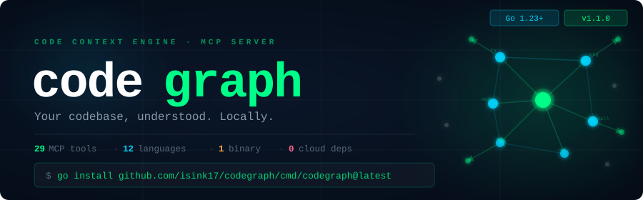

<p align="center">
  
</p>

<p align="center">
  <a href="https://github.com/isink17/codegraph/releases/latest"></a>
  <a href="https://pkg.go.dev/github.com/isink17/codegraph"></a>
  <a href="LICENSE"></a>
  
  
</p>

# CodeGraph

CodeGraph is a local-first code context engine and MCP server. It indexes a repository into a SQLite graph of symbols and source-supported relationships, then makes that context available to compatible AI coding clients without a hosted CodeGraph backend.

Use it when an assistant needs repository structure, callers and callees, related tests, or task-focused context without rebuilding that map from files for every question. CodeGraph helps navigate the code; verify proposed changes against source and the language limits below.

## Contents

**Getting started:** [Install](#install) · [First run](#first-run) · [AI client support](#ai-client-support) · [Why CodeGraph?](#why-codegraph) · [Core capabilities](#core-capabilities) · [Supported languages](#supported-languages) · [Agent Skill](#agent-skill)

**Reference:** [MCP Tools](#mcp-tools-30) · [Index and database behavior](#index-and-database-behavior) · [Result Limits](#result-limits) · [Usage / Token Meter](#usage--token-meter) · [CLI Reference](#cli-reference) · [Optional: Embeddings & Agentic Mode](#optional-embeddings--agentic-mode) · [Configuration](#configuration) · [Architecture](#architecture) · [Building from Source](#building-from-source) · [License](#license)

## Install

The current v2.0 branch is not released. To install this branch, clone it and install the command:

~~~bash
git clone --depth 1 --branch v2.0 https://github.com/isink17/codegraph.git
cd codegraph
go install ./cmd/codegraph
~~~

This requires Go 1.26.0 or newer and a C compiler for the tree-sitter CGO bindings. The Go bin directory must be on PATH.

For a no-toolchain install, [GitHub Releases](https://github.com/isink17/codegraph/releases/latest) provides native Linux, macOS, and Windows archives with SHA-256 sidecar files. Choose the archive matching your OS and architecture: `darwin_amd64` or `darwin_arm64`, `linux_amd64` or `linux_arm64`, `windows_amd64` or `windows_arm64`. Windows archives are ZIP files; the others are tar.gz. Verify the archive with its adjacent `.sha256` file before extracting it and placing the binary on `PATH`.

Compare the digest from the sidecar with the downloaded file's hash: use `shasum -a 256 <archive>` on macOS, `sha256sum <archive>` on Linux, or `(Get-FileHash <archive> -Algorithm SHA256).Hash` in PowerShell. Replace `<archive>` with the downloaded filename.

The latest published release is v1.2.0; those binaries predate the current v2.0 branch and do not provide this branch's capabilities. There is no v2.0 binary release yet.

## First run

From the repository you want to work on:

~~~bash
codegraph install
codegraph index .
codegraph doctor
~~~

`codegraph install` creates local defaults and attempts to add CodeGraph to supported clients with existing config files; it leaves existing CodeGraph entries untouched. Restart the client after configuration and ask: “Trace the request flow for this feature, then list callers and related tests.” `codegraph doctor` reports local setup and graph capability; omit it from routine indexing.

> **Database compatibility:** before v2.0.0, the v2 database is a regenerable development cache. Older v2 development indexes may be refused and need `codegraph index . --rebuild`; stop other CodeGraph processes first because rebuild needs exclusive database access. Legacy v1 databases are not imported or upgraded, and can coexist with v2 data.

Normal commands may check GitHub Releases once per 24 hours. Set `DO_NOT_TRACK` or `CODEGRAPH_NO_UPDATE_CHECK` to a non-empty value other than `0` or `false` to disable that check and prevent creation or update of the local version-check state file.

## AI client support

The default full mode advertises 30 tools. Gateway advertises four core tools plus tool_search and tool_call; agents can discover and invoke the rest on demand.

~~~bash
codegraph serve --tool-mode gateway
codegraph install --tool-mode gateway
~~~

`codegraph install` auto-configures Claude Code, Cursor, Windsurf, and Gemini CLI. Codex and other MCP clients need manual configuration; install prints snippets but does not edit Codex config. A common JSON client entry is:

~~~json
{
  "mcpServers": {
    "codegraph": {
      "command": "codegraph",
      "args": ["serve"]
    }
  }
}
~~~

For Codex, use the printed TOML snippet in its MCP configuration:

~~~toml
[mcp_servers.codegraph]
command = "codegraph"
args = ["serve"]
startup_timeout_sec = 60
~~~


## Why CodeGraph?

| Without an indexed graph | With CodeGraph |
|---|---|
| The assistant searches files and infers repository structure as it goes. | The assistant can query indexed symbols, supported relationships, and related tests through MCP. |
| It repeats discovery across questions and sessions. | A local SQLite graph persists between runs and supports focused context queries. |

The graph is evidence-based and intentionally partial: ambiguous or unsupported relationships remain unresolved. Parser capability and static language models affect relationship results; the source remains the authority.

## Core capabilities

- Index and incrementally update source repositories in a local SQLite database.
- Search symbols with full-text search and optional Ollama-backed vector embeddings.
- Query callers, callees, dependency impact, related tests, and task-focused context.
- Detect frameworks and cross-language import links; inspect graph structure, dead code, coupling, cycles, and dependencies.
- Watch files for changes, audit indexed data, and visualize the graph.
- Connect over MCP in full mode or an opt-in gateway mode; optional Ollama support adds embeddings and agentic queries.

## Supported languages

Native CGO builds of this v2.0 branch register 14 user-facing language categories through 13 adapters; JavaScript and TypeScript share the `typescript` adapter.

| Language | Extensions |
|---|---|
| Go | `.go` |
| Python | `.py` |
| TypeScript | `.ts`, `.tsx` |
| JavaScript | `.js`, `.jsx`, `.mjs` |
| Java | `.java` |
| Kotlin | `.kt`, `.kts` |
| Lua | `.lua` |
| Rust | `.rs` |
| Scala | `.scala`, `.sc` |
| C# | `.cs` |
| Ruby | `.rb` |
| Swift | `.swift` |
| PHP | `.php` |
| C / C++ | `.c`, `.h`, `.cpp`, `.hpp`, `.cc` |

Explicit `CGO_ENABLED=0` builds are not equivalent: Go and Python retain call edges, while the other languages provide heuristic symbol/import navigation without call edges. Symbols, imports, and search are incomplete in those fallback parsers. Python's fallback also misses some call sites. Relationship queries and `codegraph doctor` report graph capability.

All call resolution uses partial static models, not language runtimes. Lua extracts declarations, literal `require` imports, and call references, and resolves only a bare call whose innermost lexical binding is a never-reassigned `local function` of the same file; globals, fields, methods, modules, and any file with a parse error or that names `debug` (identifier or string) stay unresolved (CGO builds only). Scala (V1) extracts packages, imports with renames and wildcards, classes, objects, traits, enums, defs, vals, type aliases, givens and extension methods, plus call references; it builds no call edges in any build, because implicit/given scope, extension methods, inheritance and overloads decide what a Scala call runs. Node.js repositories are supported, but full tree-sitter node support is still in progress. Python models only selected source-visible mutation forms; Ruby does not infer runtime load order or Rails/Zeitwerk mappings. C# may leave `using static` calls unresolved when inheritance or enclosing members could change the target. See [language scope models](docs/scope-models.md), [Lua grammar provenance](docs/lua-grammar-provenance.md), [Scala grammar provenance](docs/scala-grammar-provenance.md), and [Ruby scope and limitations](docs/ruby-scope.md).

## Agent Skill

[skills/codegraph](skills/codegraph/SKILL.md) teaches coding agents to start with focused graph context, drill into source, and use callers, callees, and impact queries. Install it with the [Skills CLI](https://github.com/vercel-labs/skills):

~~~bash
npx skills add isink17/codegraph --skill codegraph
~~~

This installs the Agent Skill from the repository, not the CodeGraph binary. The skill supports clients that accept Agent Skills and documents both MCP modes and the CLI fallback.

## MCP Tools (30)

**Tool categories:** [Code Intelligence](#code-intelligence) · [Architecture & Analysis](#architecture--analysis) · [Repository Management](#repository-management) · [Session Memory](#session-memory) · [Agentic](#agentic)

**Details:** [Tools not listed in `tools/list`](#tools-not-listed-in-toolslist) · [Progressive disclosure (`detail`)](#progressive-disclosure-detail) · [Compact output (`format`)](#compact-output-format) · [Query contract](#query-contract) · [Graph capability and `limitations`](#graph-capability-and-limitations) · [Token budget and continuation (`context_for_task`)](#token-budget-and-continuation-context_for_task) · [Gateway MCP mode (`--tool-mode`)](#gateway-mcp-mode---tool-mode)

### Code Intelligence

| Tool | Description |
|---|---|
| `find_symbol` | Find symbols by exact or substring query |
| `search_symbols` | Search symbol names, signatures, and docs (FTS5) |
| `search_semantic` | Hybrid semantic search (vector + FTS when embeddings enabled) |
| `find_callers` | Find resolved callers of an indexed symbol |
| `find_callees` | Find resolved callees of an indexed symbol |
| `get_impact_radius` | Estimate resolved dependency impact and report uncertainty |
| `trace_dependencies` | Trace resolved dependency edges from an exact symbol |
| `find_related_tests` | Find likely related tests for a symbol, file, or changed files |
| `find_dead_code` | Find symbols with no callers or references |
| `context_for_task` | Build a focused, token-budgeted context bundle for a natural-language task |

### Architecture & Analysis

| Tool | Description |
|---|---|
| `architecture_overview` | Language breakdown, directories, entry points, hub symbols |
| `graph_analytics` | PageRank, coupling metrics, or cycle detection |
| `detect_frameworks` | Detect frameworks and libraries used in the repo |
| `cross_language_links` | Find and create cross-language symbol references |
| `benchmark_tokens` | Estimate token savings vs. reading raw files |

### Repository Management

| Tool | Description |
|---|---|
| `index_repo` | Index a repository into the local code graph |
| `update_graph` | Update only changed files |
| `list_files` | List indexed files with optional path filter |
| `graph_stats` | Repository graph statistics |
| `supported_languages` | List supported languages and extensions |
| `list_repos` | List known repositories |
| `list_scans` | List recent scans |
| `latest_scan_errors` | List indexer errors from the last scan |
| `audit` | Audit the indexed graph for integrity, resolver-correctness, and trust issues (read-only). Optional `examples` integer caps examples per finding; `0` means counts only |
| `check_constraints` | Check architectural dependency rules between path groups declared in the repo-root `.codegraph-constraints.json` (read-only). `limit`/`offset` page the findings; see [docs/constraints.md](docs/constraints.md) |

### Session Memory

| Tool | Description |
|---|---|
| `session_log` | Log a session event (read, edit, decision, task, fact) |
| `session_history` | Get session event history |
| `session_hot_files` | Get most frequently accessed files |
| `session_context` | Get aggregated session context for pre-loading |

### Agentic

| Tool | Description |
|---|---|
| `agentic_query` | Ask a question answered by a local AI agent that reasons over the code graph (requires Ollama) |

### Tools not listed in `tools/list`

`file_history`, `explain_edge`, and `usage_stats` are callable by exact name but are not advertised in either tool mode. Gateway clients can find them with `tool_search`; full-mode clients need to call the documented name directly. See [file history](docs/git-history.md), [edge explanations](docs/explain.md), and [usage / token meter](#usage--token-meter).

### Progressive disclosure (`detail`)

`find_symbol`, `search_symbols`, `find_callers`, `find_callees`, and
`get_impact_radius` accept an optional `detail` argument. It controls how much of
each symbol comes back, and nothing else -- traversal results still report the
same symbols, files, and counts at every level.

| `detail` | What each symbol carries | Use it to |
|---|---|---|
| `card` (default) | name, qualified name, kind, language, file, line, symbol id, stable key | choose between candidates and drill down |
| `skeleton` | + signature, visibility, container, doc summary, end line, member declarations | inspect an API or a type's shape |
| `excerpt` | + source around the symbol: a few lines of context, capped tightly, marked `truncated` when the symbol is longer | read the implementation around a target |
| `full` | + a large bounded source window that contains what `excerpt` returned, plus `range` and `file_id` | inspect the richest projection |

`detail=full` returns every field these tools returned before progressive
disclosure existed, under the same name and with the same value, so nothing became
unreachable. Its source is a large bounded window; truncation is explicit. The one
difference: a field whose value is empty is omitted rather than sent as `""` or
`0`, which is what every other level does too. Use a card's `qualified_name` as a
`find_symbol` query. Where relationship tools accept `symbol_id`, prefer that exact
identity; `stable_key` is metadata, not a universal selector.

Source is read from disk only for `excerpt` and `full`, and only for the symbols
actually being returned; `card` and `skeleton` touch no files. Rendered source is
always LF-joined and confined to the repository root, and the file is compared
against what the indexer recorded, so source read from a file that changed after
indexing comes with a `source_note` saying so rather than silently misattributed.

Everything that thins a response says so. `truncated` marks source cut by a line
ceiling or clamped to a file that has since shrunk and reports the real range in
`available_start_line`/`available_end_line`; `member_count` appears when a
skeleton's member list was capped; and `skeleton_note` / `source_note` explain
every other case -- a container whose members were not looked up, a symbol whose
source was omitted, a parser that recorded no body range, a file that changed
since indexing. Results are still bounded pages: one response looks up members
for a bounded number of containers and renders source for a bounded number of
symbols; the rest carry the matching note. Both bounds sit well above any paged
request, so a `limit` you asked for is always honoured in full.

The tools that still return the pre-projection symbol shape -- `search_semantic`,
`find_dead_code`, `trace_dependencies`, `find_related_tests`, and
`context_for_task` -- are unchanged, because their records are already card-sized
and adding `detail` to them could only make a response larger.

### Compact output (`format`)

`find_symbol`, `search_symbols`, `find_callers`, `find_callees`,
`get_impact_radius`, `find_related_tests`, `find_dead_code`, `list_files`, and
`trace_dependencies` accept an optional `format`:

| `format` | Encoding |
|---|---|
| `json` (default) | the ordinary `{"ok":true,"data":...}` envelope |
| `compact` | a tabular text document that states the columns once instead of repeating a key on every row |

`format` is optional and defaults to JSON. The JSON form remains the standard
response format, but newer releases may add presence, uncertainty, or pagination
metadata fields; clients should ignore unknown additive fields. `compact` removes
repeated JSON keys and is intended to reduce payload size on bulk card pages; it
only encodes `detail=card`, which is the default.
`detail=skeleton`, `excerpt`, and `full` with `format=compact` are rejected rather
than silently answered with cards: beyond a card the payload is source text and
prose, where the keys are a rounding error. Errors are ordinary MCP tool errors in
either encoding.

A typical loop is discover cheaply, then drill into one symbol:

```
search_symbols(query="resolve", limit=50, format="compact")   # pick a symbol_id
find_symbol(query="<qualified_name>", detail="excerpt")       # read the code
```

`search_semantic` and `graph_analytics` stay JSON-only: their row shapes are not
fixed (a hybrid semantic hit carries a `kind` the fallback does not, and `why` is
a list), so a fixed-column table would have to drop or nest a field.
`context_for_task` stays JSON-only because its `estimated_tokens`/`max_tokens`
contract budgets the exact JSON document it returns; compacting after budgeting
would make the reported estimate describe a payload the caller never received.

**compact/v1 grammar.** The format identifier is `codegraph.compact/v1`, and it is
versioned independently of the CodeGraph release version.

```
@codegraph.compact/v1
@tool search_symbols
@section matches
@columns symbol_id→stable_key→name→qualified_name→kind→language→file→line
253→type:audit:CaseResult→CaseResult→audit.CaseResult→type→go→internal/audit/audit.go→158
```

(`→` is a literal tab above.)

- **Lines** are separated by LF on every platform, and the document ends with a
  single LF. Directives begin with `@`; every other line is a row.
- **Fields** are separated by a tab. A row always has exactly as many cells as its
  section has columns, in the order `@columns` gives.
- **Sections** have stable names and a stable order, and each has its own columns.
  `get_impact_radius` emits `symbols`, then `files`, then `summary`, plus seed
  presence metadata, so traversal counts stay separate from symbol rows rather
  than being flattened into them.
- **Escapes**, and nothing else — no trimming, no case folding, no path
  rewriting: `\\` backslash, `\t` tab, `\n` line feed, `\r` carriage return, `\@`
  at sign. Any other `\x` is a decode error. A path is opaque data, so a literal
  backslash in a Windows-style name round-trips as itself.
- **Values.** Text as-is; integers in decimal; floats in the shortest form that
  parses back exactly; booleans as `true`/`false`.
- **Empty and absent.** Columns are fixed, so there is no "key omitted": a field
  JSON drops for being empty is an empty cell, which reads back as the same zero
  value. A section with no rows is still a header, so an empty result is a valid
  document.

`compact` is an MCP encoding. The CLI is unchanged: its only `--format` is
`graph export`'s `json|dot`, which means something else.

### Query contract

Relationship tools report only persisted, resolved edges. Unresolved spellings
are evidence, not confirmed relationships. For `find_callers`, an unknown name
may therefore produce `unresolved_hints` separately from `callers`; those hints
do not identify callers of a known indexed symbol.

When `symbol_id` is accepted, a non-zero value is the authoritative identity in
the current repository. The `symbol` string is used to resolve a target only
when `symbol_id` is not provided; a stale or foreign ID is not rescued by the
string.

Presence is independent of the current page: `matched` on `find_symbol` and `search_symbols` means the query has
at least one match (`search_semantic` does not expose presence metadata), while `target_found` means the requested relationship,
test, or trace target resolved and its result may still be empty. A missing
related-test or trace target is a successful result with `target_found: false`.

`get_impact_radius` returns `seed_presence` with `requested`, `found`, and
`missing`. Its `summary.unresolved_edges` and `summary.unresolved_names` count
unresolved outgoing evidence in the full resolved impact closure; they do not
expand traversal, map names to candidates, or change with page size/offset.

`trace_dependencies` resolves one exact semantic seed and follows resolved
edges only. Exact qualified identities take precedence; ambiguous name lookup fails closed.
Its `total` is the full canonical traversal size before pagination, `offset` is
the effective (clamped) page offset, and `truncated` says whether more canonical
rows remain after the returned page. There is no CLI trace command.

#### Graph capability and `limitations`

Call relationships are only as complete as the parsers that wrote the persisted
graph, which may be a different build from the one answering. Each language's
capability is read from the parser profiles stored per file:

| `graph_capability` | Meaning |
|---|---|
| `call_capable` | Every file was written by one parser profile that emits call edges |
| `symbols_only` | Every file was written by one profile that emits no call edges |
| `unknown_provenance` | Some files predate recorded parser provenance |
| `mixed` | The files were written by more than one profile or capability; at graph level, languages disagree |

`supported_languages` adds `graph_capability` (`state` plus per-language
`graph_capability` and `parser_profiles`) once the repository has a graph.

`find_callers`, `find_callees`, `get_impact_radius`, `trace_dependencies`,
`find_related_tests`, `find_dead_code`, `graph_analytics` and `context_for_task`
(unless `include_callers` is `false`) add a top-level
`limitations` list next to `ok` and `data` when the graph holds a language that is
not fully call-capable:

```json
{"data":{"callers":[],"target_found":true},"limitations":[{"language":"java","graph_capability":"symbols_only","effect":"call edges absent: indexed symbols-only; an empty or short result is not evidence of no relationship"}],"ok":true}
```

The list is repository-wide: a caller, an impact path or a dead-code verdict can
cross languages, so every affected language is listed. A `call_capable` language
is also listed when its profile is the approximate `python-regex` fallback, which
misses some call sites. When every language is call-capable through a complete
parser the field is absent and the response is byte-for-byte unchanged. Compact
responses (`format=compact`) carry the same rows in a `limitations` section, and
the CLI `callers`, `callees`, `impact` and `find_related_tests --json` commands add
the same `limitations` key to their JSON. `find_related_tests` without `--json`
keeps stdout a path list and prints one `limitations:` line to stderr.
`context_for_task`'s `estimated_tokens` covers `data` only, so the list does not
change it. `codegraph doctor` reports the same four states per repository under
`parser.graph_capability`, with a recommendation when the graph is reduced.

Not covered: `architecture_overview` (hub symbols are ranked by call edges),
`cross_language_links` and `agentic_query` answers carry no `limitations`
field; read `supported_languages` for the graph's capability.

### Token budget and continuation (`context_for_task`)

`context_for_task` is the selector at the front of that workflow: it ranks the
context for a task and returns as much of it as a token budget pays for, with the
identity needed to drill into anything it named. Any caller/callee context is
based on resolved relationship edges, not guessed name matches.

| Argument | Meaning |
|---|---|
| `max_tokens` | Budget for the serialized context document. Omitted or `0` uses 4000; negative is an error; anything above 200000 is clamped. |
| `cursor` | Opaque `next_cursor` from a previous call, to fetch the context that did not fit. |

The count is an estimate -- `ceil(bytes / 4)` over the response document itself,
not a model provider's tokenizer. `estimated_tokens` is measured on the exact
document returned, its file envelopes, counters and `next_cursor` included, so a
page never overshoots the budget it advertises. The budget covers that document;
the MCP result wrapper around it (`{"ok":true,"data":...}`) adds a further ~5
estimated tokens.

`max_files` bounds the production files the answer covers; the `test_files`
section is bounded separately, by the tests linked to those files. Candidates are
ranked before they are budgeted: direct semantic matches first, then callers and
callees of those matches, then the tests that cover them. Only the strongest few
matches are expanded through the graph, so a call's cost does not grow with the
number of search hits, and a match the search itself rated near zero can fall
behind a caller of the top match -- a match with real relevance never does. The
order is a total order (score, relevance class, file path, stable identity), so
two calls against the same graph return byte-identical pages and an offset cursor
is safe.

When context is withheld, the response carries `has_more`, `remaining_symbols`,
and `next_cursor`. Replay the same `task` and the same ranking options with the
cursor to continue; `max_tokens` may differ between pages. A cursor is refused --
rather than silently skipping or repeating context -- if the repository, the task,
a ranking option, the indexed generation, or the ranking itself has changed since
it was issued. Start again without a cursor in that case.

Each returned symbol carries `symbol_id`, `stable_key`, and `qualified_name`, and
its `signature`/`doc_summary` are bounded card-sized values. Source is never
embedded: use `qualified_name` with `find_symbol` and, where relationship tools
accept it, prefer exact `symbol_id`; `stable_key` remains metadata. Request
`detail=excerpt` or `detail=full` when you need the code.

The same four levels are available on the CLI as `--detail`. The CLI default is
different on purpose: `codegraph find_symbol` and friends keep printing every
indexed field unless `--detail` is passed, because their JSON has always been
consumed by scripts.

**Language coverage.** `skeleton` members and `full` bodies need the parser to
have recorded a symbol's end line. The tree-sitter parsers (the default `cgo`
build) do; the regex fallback parsers used in `CGO_ENABLED=0` builds record only
the declaration line, as does the pure-Go Python parser. For those, a skeleton
says so in `skeleton_note` instead of listing members, and `full` returns a
bounded window around the declaration with a `source_note` explaining why. Go
built with either registry is unaffected.

### Gateway MCP mode (`--tool-mode`)

Describing 30 tools costs a session 12,974 bytes, or 3,244 estimated tokens
(`ceil(bytes / 4)`), before it asks a single question. Gateway mode is an opt-in
surface that charges a fraction of that without removing anything:

```bash
codegraph serve --tool-mode gateway
codegraph install --tool-mode gateway   # write it into the client config
```

`install` never overwrites a `codegraph` entry a client config already has. If you
are already configured, it prints the `args` to change (`["serve", "--tool-mode",
"gateway"]`) rather than replacing your entry.

| Mode | `tools/list` | Estimated tokens |
|---|---|---|
| `full` (default) | all 30 tools | 3,244 (12,974 bytes) |
| `gateway` | 4 core tools + `tool_search` + `tool_call` | 1,016 (4,062 bytes; about 69% fewer) |

`full` remains the default and advertises all 30 tools. The two gateway tools
appear only in gateway mode.

In gateway mode the tools an ordinary navigation session uses on nearly every task
stay direct — `context_for_task`, `find_symbol`, `find_callers`, `find_callees` —
so the common workflow needs no lookup at all. Everything else is found and called
on demand:

```
tool_search(query="dependency trace")            # -> trace_dependencies
tool_call(name="trace_dependencies",
          arguments={"symbol": "Resolve", "depth": 3})
```

`tool_search` returns card-sized metadata: name, one-line description, category,
whether the tool is already direct, and whether it writes. Results are bounded (5
by default, 20 at most) and deterministic — it is a local name-and-description
search, with no index, embeddings, or network. Add `include_schema` with an exact
tool name to get that tool's argument schema, which is the same schema `tools/list`
advertises in full mode.

`tool_call` invokes the canonical tool: the same argument validation, the same
handler, and the same result. `detail`, `format=compact`, `max_tokens`, and
`cursor` all behave exactly as they do on a direct call, and errors arrive as the
target tool's own error. The tool tables above stay the reference for what each
tool does and what it accepts.

The mode is chosen at startup and fixed for the life of the server; no tool can
change it. Restart with the other mode to switch.

[Back to Contents](#contents)

---

## Index and database behavior

`codegraph index . --rebuild` performs a full reindex and replaces the v2 database; use it after parser or indexer changes when stale rows must be cleared. It requires exclusive database access.

Normal `codegraph update .` upgrades supported parser profiles and versioned resolver policies. Resolver-only policy changes re-evaluate existing edges without reparsing unchanged source; later updates are no-ops. Newer or unreadable policy markers refuse affected work before graph writes. Parser-fact changes still require a parser profile upgrade.

Parser profile IDs identify the implementation and semantics used to decide whether unchanged files need reparsing. A separate parser-family generation records directional compatibility per repository and language, including CGO and no-CGO Python. Updates upgrade missing or older generations and reparse as needed; newer or malformed generations refuse affected work before scan writes. Full or forced indexing checks every language policy, even when a language filter limits parsing. A parser family shares a generation only while its implementations have the same persisted semantics.

Use `codegraph clean .` for database maintenance such as WAL checkpointing, VACUUM, FTS optimize, ANALYZE, and incremental vacuum.

## Version

~~~bash
codegraph --version
codegraph version
~~~

These commands print the installed local version without contacting GitHub.


## Result Limits

Every public query returns a bounded page. The bounds exist so that one
mistyped argument cannot spend a model's entire context, or make SQLite sort a
repository into memory.

| Argument | Default | Maximum | Applies to |
| --- | --- | --- | --- |
| `limit` | 20 | **500** | every paged query at `detail=card` |
| `limit` | 20 | **200** | `detail=skeleton` |
| `limit` | 20 | **50** | `detail=excerpt` and `detail=full` |
| `offset` | 0 | uncapped | every paged query |
| `depth` | 2 (impact), 3 (trace) | **10** | `get_impact_radius`, `trace_dependencies` |
| `symbols`, `files` | — | **500 items** | batch arguments that cost one lookup each |
| `max_steps` | agent default | **20** | `agentic_query` |
| `examples` | 5 | **100** | `audit` |

Rules worth knowing:

- **Above the maximum is an error, not a trim.** A request for 100000000 rows
  is refused with a message naming the bound. Silently returning 500 would tell
  the caller something false about its own request.
- **`limit=0` still means "use the default".** That convention is unchanged.
  A negative `limit` or `offset` is an error; it never had a meaning.
- **Pagination is untouched.** The maximum bounds one page, not the result set,
  so `limit=100&offset=100000` is an ordinary request. Walking pages returns
  every row exactly once, in stable order.
- **`format` and `detail` cannot raise a bound.** `format` chooses how rows are
  written, never how many exist, so `format=compact` obeys the same ceiling as
  JSON. `detail` *lowers* it, because a record carrying source text costs
  several times what a card costs.
- **Traversals say when a page is partial.** `get_impact_radius` and
  `trace_dependencies` report the full traversal size alongside the page and set
  `truncated`, so a bounded answer never reads as a complete one.
- **Rejection happens before the query runs**, so an oversized request costs a
  comparison rather than a scan.
- **Two tools keep their own policy**, because both were already bounded and
  both clamp rather than reject: `tool_search` (max 20) and the hidden
  `usage_stats` (max 200). `context_for_task` keeps its own `max_tokens` budget
  and cursor.
- **`graph export` is not a query page.** It streams, and `--limit 0` still
  means "the whole repository". Only the non-streaming paged form is bounded, at
  100000, and the error points back at `--limit 0`.

The MCP schema is the machine-readable source: every bounded argument publishes
its `minimum` and `maximum`, so a client can read the limit instead of
discovering it by being refused. The CLI enforces the same numbers.

### Missing things and errors

An empty result and a missing entity are different answers and stay different:

- a search with no matches is a valid empty result, not an error;
- an indexed symbol that genuinely has no related tests returns an empty list;
- symbol targets in callers, callees, impact, trace, and related-test queries
  prefer exact qualified names before name fallbacks; multiple candidates at the
  selected tier fail closed as ambiguous, distinct from a missing seed;
- a real database failure stays a database error and is never relabelled
  "not found".

---

## Usage / Token Meter

CodeGraph meters its own context cost so the savings above are observable rather
than claimed. The meter is entirely local: it lives in the running MCP server,
holds only numbers, and there is no telemetry, no network call, and no database
write. One server lifetime is one session; restarting `serve` resets it.

**`estimated_tokens` is a deterministic size estimate — `ceil(bytes / 4)` — not a
provider's tokenizer and not billing usage.** Treat it as a stable way to compare
two responses, not as a number to reconcile against an invoice.

### What is measured

Only the model-visible layer:

| Event | Request | Response |
|---|---|---|
| `tools/list` | the params object | the serialized tool-definition array |
| `tools/call` | the arguments object as sent | the tool content text, or the error document that replaced it |

JSON-RPC ids, the result envelope, and stdio framing are excluded — they are
bytes on a pipe, not bytes a model reads. A `format=compact` response is measured
as the compact document itself, before any transport escaping.

### Reading the report

`usage_stats` is registered but advertised nowhere, so neither tool surface grows
by a byte for having a meter. Call it by exact name in either mode:

```json
{"jsonrpc":"2.0","id":1,"method":"tools/call",
 "params":{"name":"usage_stats","arguments":{}}}
```

In gateway mode it is also discoverable — `tool_search("usage tokens")` finds it,
and `tool_call(name="usage_stats", arguments={})` runs it.

The per-tool table is bounded: it returns the 25 most expensive rows by default
alongside a `tools_total` count, and `limit` changes that. Session, discovery,
and invocation totals always cover every call, so trimming loses detail, never
accuracy.

Pass `reset: true` to take a snapshot and clear the counters in one atomic step.
That clears meter counters only — never graph or session data.

The snapshot covers usage up to, but not including, the call that asked for it —
a response cannot report its own size before it exists. That call is booked
afterwards and appears in the next snapshot, including after a `reset`: the new
window opens with the resetting call already in it.

`codegraph serve --usage-summary` prints the same report to **stderr** once at
exit, for clients that would rather not spend a tool call on it. It never touches
stdout, which is the MCP transport.

### Attribution

A row names the canonical tool that ran, with a `via` dimension for how it was
reached. A gateway `tool_call` is charged to its target, once:

```json
{"name": "search_symbols", "via": "direct",  "format": "json",    "detail": "card", "calls": 1, "response_estimated_tokens": 3048},
{"name": "search_symbols", "via": "gateway", "format": "compact", "detail": "card", "calls": 1, "response_estimated_tokens": 1768}
```

`tool_search` is a real model-visible call and gets its own row. `format` and
`detail` buckets appear only for tools that accept those arguments, and an
omitted `detail` is reported as the real effective default (`card`), so
"how much does `full` cost versus `card`?" is answerable from one session's data.
Dimensions come from closed sets — a tool name from the registry, an invocation
path, an encoding, a detail level — so nothing a caller types can become a metric
label, and no argument, task string, or payload is ever retained.

---

## CLI Reference

```bash
# Setup
codegraph install                         # Auto-configure AI tools
codegraph install --tool-mode gateway     # Auto-configure with the reduced tool surface
codegraph doctor                          # Check installation health
codegraph config show                     # Show current config
codegraph --version                       # Print current version
codegraph version                          # Print current version

# Indexing
codegraph index <path>                    # Full index
codegraph update <path>                   # Incremental update
codegraph watch <path>                    # Watch and auto-reindex
codegraph clean <path>                    # Clean database

# MCP Server
codegraph serve [--repo-root <path>]      # Start MCP server (auto-detects repo root)
codegraph serve --tool-mode gateway       # Start with the reduced tool surface
codegraph serve --usage-summary           # Print the local context-usage report to stderr on exit

# Graph audit
codegraph audit <path>                    # Audit the indexed graph for integrity/trust issues
codegraph audit <path> --examples 0       # Counts only, no examples
codegraph audit <path> --fail-on error    # Exit non-zero when the graph has error findings

# Architectural constraints (see docs/constraints.md)
codegraph index . && codegraph check_constraints .   # Exit 0 ok, 1 violations, 2 cannot evaluate
codegraph check-constraints . --config rules.json    # Alias; evaluate another constraints document

# Git history (see docs/git-history.md)
codegraph file_history <path>             # Files with the most recent-window commits first
codegraph file_history <path> --file F    # History of one or more files
codegraph file_history <path> --file F --symbols  # Plus each symbol's last-touching commit (git blame)

# Edge explanations (see docs/explain.md)
codegraph explain . --file cmd/main.go --line 13     # Why each edge on that line is (un)resolved
codegraph explain . --edge-id 1234                   # One edge by id

# Query latency benchmark (read-only; never indexes or migrates)
codegraph bench-queries <path>                    # Benchmark local graph queries on an indexed repo
codegraph bench-queries <path> --runs 50          # More samples for a tighter p95
codegraph bench-queries <path> --budget-ms 25     # Report against a stricter budget
codegraph bench-queries <path> --fail-over-budget # Exit non-zero after printing the report

# Query
codegraph stats <path>                    # Graph statistics
codegraph find-symbol <path> <query>      # Find symbols
codegraph search <path> <query>           # Full-text symbol search
codegraph callers <path> --symbol <name>  # Find callers
codegraph callees <path> --symbol <name>  # Find callees
codegraph impact <path> --symbol <name>   # Impact analysis

# Testing
codegraph affected-tests [--stdin] <files>  # Tests affected by changed files

# Visualization & Export
codegraph visualize [--repo-root <path>]    # Interactive D3.js graph (auto-detects repo root)
codegraph graph export <path> --format dot  # Export as Graphviz DOT
codegraph graph export <path> --format json # Export as JSON

# Benchmarking
codegraph benchmark                         # Token savings benchmark
```

### Affected Tests with Git

```bash
# Find tests affected by uncommitted changes
git diff --name-only | codegraph affected-tests --stdin

# CI integration
TESTS=$(git diff --name-only HEAD~1 | codegraph affected-tests --stdin)
go test $TESTS
```

Replace `--repo-root .` with nothing if you are already in the repo you want to inspect.

---

## Optional: Embeddings & Agentic Mode

codegraph works fully without any external services. Enable these for enhanced capabilities:

### Vector Embeddings (via Ollama)

Enables hybrid semantic search (vector + FTS):

```bash
# Install and pull embedding model
ollama pull nomic-embed-text

# Initialize repo config
codegraph config init --repo .
```

Edit `.codegraph/config.json`:

```json
{
  "embedding": {
    "enabled": true,
    "model": "nomic-embed-text"
  }
}
```

Then re-index to generate embeddings:

```bash
codegraph index . --force
```

### Agentic Reasoning (via Ollama)

The `agentic_query` tool uses a local LLM to reason over the graph with a ReAct loop:

```bash
ollama pull llama3.2
```

Edit `.codegraph/config.json`:

```json
{
  "agent": {
    "enabled": true,
    "model": "llama3.2"
  }
}
```

---

## Configuration

### Global config

| Platform | Path |
|---|---|
| macOS | `~/Library/Application Support/codegraph/config.json` |
| Linux | `${XDG_CONFIG_HOME:-~/.config}/codegraph/config.json` |
| Windows | `%AppData%\codegraph\config.json` |

### Repo config

Created with `codegraph config init --repo .` at `.codegraph/config.json`:

```json
{
  "include": [],
  "exclude": ["vendor/**", "node_modules/**"],
  "languages": [],
  "embedding": {
    "enabled": false,
    "model": "nomic-embed-text"
  },
  "agent": {
    "enabled": false,
    "model": "llama3.2"
  }
}
```

### Repo Root Resolution

At CLI startup, codegraph resolves the repo root using:

1. `--repo-root` CLI flag (or the positional repo argument)
2. `git rev-parse --show-toplevel` from the current working directory
3. `os.Getwd()` (current working directory)
4. Return error

An MCP server is opened for one active repository, resolved once by that startup
chain. The `repo_root` and `repo_path` tool parameters on `index_repo` and
`update_graph` remain accepted, but they may only **assert** the server's active
repository -- naming any other path (another repository, a parent directory, or a
subdirectory of the active root) is rejected with a repository scope violation
rather than retargeting the running server. Likewise, `paths` entries must name
locations inside the active repository; `../` traversal and absolute paths outside
the root are rejected. To index a different repository, start a server for it.

### Ignore file

Create `.codegraphignore` in the repo root (same syntax as `.gitignore`):

```
build/
dist/
*.generated.go
```

> **Note:** Common generated directories (`node_modules`, `.next`, `.nuxt`, etc.) are always skipped and cannot be un-ignored.

---

## Architecture

```
cmd/codegraph           CLI entrypoint
internal/
  agent/                Agentic reasoning (ReAct loop over Ollama)
  appname/              Centralized product and binary naming
  audit/                Developer-only resolver-correctness harness (not a CLI/MCP command)
  classify/             Classification of unresolved edge targets (builtin/stdlib/external/unknown)
  cli/                  Command handlers and MCP auto-configuration
  compactfmt/           codegraph.compact/v1 encoding for format=compact
  config/               Config loading and path resolution
  constraints/          codegraph check_constraints / MCP check_constraints
  detail/               Progressive symbol detail levels (card/skeleton/excerpt/full)
  doctor/               codegraph doctor diagnostics
  embedding/            Vector embedding (Ollama HTTP client, noop fallback)
  export/               JSON and DOT graph export
  framework/            Framework detection (20+ frameworks)
  gotool/               Go binary path hints for install and doctor output
  graph/                Core types (Symbol, Edge, Reference, …)
  graphaudit/           codegraph audit / MCP audit over an indexed graph
  indexer/              Repository scan, incremental updates, embedding
  latency/              Percentile arithmetic shared by query benchmarks
  limits/               Shared page, depth, and batch size bounds
  logging/              slog logger construction
  mcp/                  MCP stdio server (30 tools)
  parser/               Parser interface and adapters
    treesitter/         Tree-sitter adapters (12 languages; CGO builds)
    golang/             Go go/ast parser (CGO_ENABLED=0 builds)
    python/             Pure-Go Python parser (CGO_ENABLED=0 builds; binding helpers reused by tree-sitter)
    heuristic/          Regex symbol/import parsers for the other languages (CGO_ENABLED=0 builds)
    gofixture/          Shared Go fixtures both Go adapters are tested against
  platform/             Cross-platform path and OS helpers
  query/                Query orchestration and hybrid search
  querybench/           Read-only query latency benchmark (bench-queries)
  search/               Package doc only (no code)
  store/                SQLite storage, migrations, edge resolution, graph analytics
  texttoken/            Token weighting for full-text and semantic ranking
  tokenest/             Deterministic token estimator (ceil(bytes/4))
  usage/                In-process MCP context-usage meter (serve --usage-summary)
  version/              Build and runtime version reporting
  versioncheck/         Opt-out release check (CODEGRAPH_NO_UPDATE_CHECK, DO_NOT_TRACK)
  viz/                  Interactive D3.js graph visualization
  watcher/              File watch and debounced updates
```

---

## Building from Source

```bash
git clone https://github.com/isink17/codegraph
cd codegraph
go build ./cmd/codegraph
go test ./...
```

Requires Go 1.26.0 or newer and a C compiler for the tree-sitter CGo bindings.

For a clean rebuild after parser/indexer changes:

```bash
codegraph index . --rebuild
```

This rebuild path needs exclusive access to the repo database. If it fails because another `codegraph` process is holding the DB, stop that process and retry.

### Continuous integration

Pull requests target the `v2.0` branch. A change that touches only `CHANGELOG.md`, `README.md` or Markdown files under `docs/` runs a short documentation check (`git diff --check`, valid UTF-8, closed code fences, working relative links). Every other change, including a mix of documentation and code, runs the full suite: tests on Linux, macOS and Windows, race, quality and no-cgo jobs. The `windows-stress` label always runs the full suite plus the deep Windows stress gate. The aggregate `ci` check reports the result.

---

## License

This project is licensed under the **Functional Source License, Version 1.1, Apache 2.0 Future License** (`FSL-1.1-Apache-2.0`).

On the second anniversary of each version's release, that version converts to the MIT License. See [`LICENSE`](LICENSE) for full terms.
